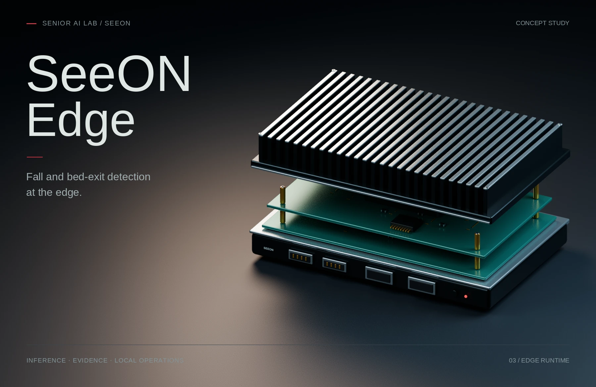

<p align="center">
  
</p>

<p align="center"><sub>SENIOR AI LAB · SEEON</sub></p>

<h1 align="center">SeeON Edge</h1>

<p align="center">
  <strong>Fall and bed-exit detection at the edge.</strong><br />
  Inference, evidence, and a local operations dashboard.
</p>

<p align="center">
  <a href="#setup">Setup</a> ·
  <a href="#run">Run locally</a> ·
  <a href="#edge-deployment">Deployment</a> ·
  <a href="#operations">Operations</a>
</p>

The edge runtime brings together an RTSP inference worker, a control/status gateway, and a local dashboard. This README describes the current `main` implementation; proposed runtime migrations are not release claims.

## Architecture

| Component | Responsibility |
| :--- | :--- |
| `backend/` | FastAPI control, status, and relay gateway; deployed as `ml-api` |
| `worker/` | RTSP inference worker that relays facts to the backend; deployed as `ml-worker` |
| `front/` | React/Vite dashboard SPA served by the backend |
| `shared/` | Backend↔worker wire code in `shared.events` |
| `contracts/` | Top-level vendored contract leaf (ADR-0006) |

Historical training lived in the archived `SeniorAILab/eldercare-dataset-ops`. The repository retains the `eldercare-fall-ml` deployment identity and its existing image names and environment-variable prefixes.

## Setup

Requires [uv](https://docs.astral.sh/uv/). The development interpreter is pinned
to Python 3.12 by `.python-version`, which is what `uv sync` below resolves.

```bash
uv sync
uv run pytest -q
uvx ruff check .
uv run --group lint lint-imports   # architecture-boundary enforcement
uv run --group lint mypy contracts shared   # type-boundary enforcement
```

`pyproject.toml` keeps `requires-python = ">=3.11"` because that floor is the
union of two images that are deliberately not on the same interpreter:
`Dockerfile.backend` builds `ml-api` on 3.11, `Dockerfile.edge` builds
`ml-worker` on 3.12. Only the worker actually needs 3.12 — it uses
`typing.override` (`worker/domains/base.py`), which is 3.12+. A single `uv sync`
venv has to serve both instances plus the test suite (which imports `worker`),
so the development pin takes the higher of the two. Neither Dockerfile copies
`.python-version`, and both set `UV_PYTHON_DOWNLOADS=never`, so this pin does
not reach either image build.

Local model artifacts are intentionally ignored. Place them under `models/` and
copy `worker/ml-worker.example.yaml` to `worker/ml-worker.local.yaml` before
configuring a real worker-reachable RTSP URL. Never commit RTSP credentials or
relay tokens.

## Run

### Local state

The backend stores durable state only in PostgreSQL. A local run needs a
PostgreSQL 18 server whose schemas were created by
`python -m backend.app.edge_db.migration provision`, and three environment values
(`backend/app/postgres_root.py`):

| Env var | Meaning |
| --- | --- |
| `API_POSTGRES_DSN_FILE` | file holding the runtime connection string |
| `API_POSTGRES_AUTHORITY_FILE` | file holding the persistence authority |
| `API_POSTGRES_SCHEMA` | schema name, default `seeon_edge` |

The clip store is fixed at `/var/lib/clip-store` for both the worker and
`ml-api`; `compose.edge.yaml` mounts it. `CLIP_STORE_DIR`,
`API_CONNECTION_SETTINGS_PATH` and `API_LABEL_STORE` are retired: the backend
refuses to start while any of them is set.

### Backend

```bash
API_POSTGRES_DSN_FILE=/path/to/runtime.dsn \
API_POSTGRES_AUTHORITY_FILE=/path/to/authority.json \
API_EDGE_RELAY_TOKEN=local-edge-relay-token \
uv run uvicorn backend.app.main:app --host 127.0.0.1 --port 8000
```

`API_EDGE_RELAY_TOKEN` must equal `relay.token` in the worker's YAML — the
worker sends it as `X-Edge-Relay-Token` and `ml-api` compares against this env
var. `GET /api/v1/health` reports `relay.token_configured` so the pairing is
observable without sending a relay call.

### Worker

Validate and run the worker with a local configuration:

```bash
uv run python -m worker --config worker/ml-worker.local.yaml --check-config

ML_WORKER_PROFILE=cpu \
uv run python -m worker --config worker/ml-worker.local.yaml
```

`cpu` is the only profile whose device check passes without a GPU.
`ML_WORKER_DEV_MJPEG*` and `CLIP_STORE_DIR` are retired; the worker refuses to
start while any of them is set.

Run the front dev server:

```bash
pnpm --dir front install --frozen-lockfile
ML_API_PROXY_TARGET=http://127.0.0.1:8000 pnpm --dir front dev
```

## Edge deployment

Copy `.env.edge.prod.example` to `.env.edge.prod`, then replace the real
per-site values: the `.example` backend URL, relay token, dashboard
credentials, Flow batch size, the host clip-store directory, and the
digest-pinned GHCR image references. Every other variable
`compose.edge.yaml` requires already ships with a working default, so a
single `.env.edge.prod` is enough — no second env file needed.
Event delivery is always active once relay credentials are valid. Clip export
is a persisted Edge dashboard setting that defaults OFF and applies live without
a worker restart; backend capability checks still gate actual clip relay.

Before `up`, verify the env file actually renders and has no leftover
`<placeholder>` values:

```bash
scripts/edge-preflight/check-env.sh .env.edge.prod
```

Then start the edge-only DeepStream Flow stack from this repository root:

```bash
docker compose --env-file .env.edge.prod -f compose.edge.yaml up -d
```

The images are published as
`ghcr.io/seniorailab/eldercare-fall-ml/{ml-api,ml-worker}` (deployment identity;
these map to `Dockerfile.backend` / `Dockerfile.edge`). `compose.edge.yaml`
uses `models/` as the default host model-artifact path.

## License notice

This project is licensed under the GNU Affero General Public License v3.0
(`AGPL-3.0-only`); see [`LICENSE`](LICENSE) for the complete terms.

The `ultralytics` worker dependency is also licensed under AGPL-3.0. This
project accepts the obligations of that dependency's AGPL-3.0 license,
including the applicable source-disclosure requirements.

The hero is conceptual artwork. It contains no camera feed, resident data, or production-status evidence.

[Artwork provenance](./docs/assets/ARTWORK.md) · Original procedural Blender/Cycles reconstruction.
